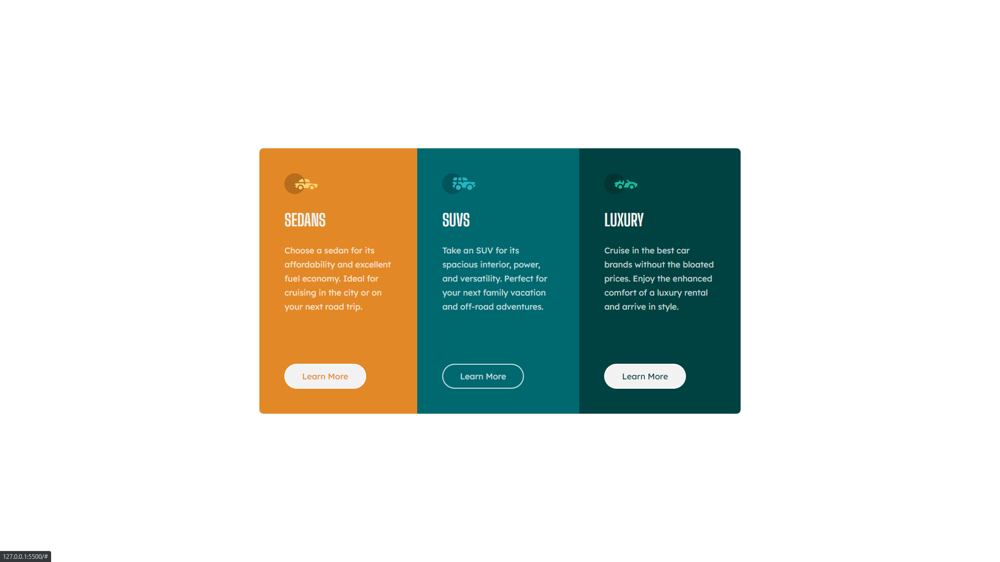

# Frontend Mentor - 3-column preview card component solution

This is a solution to the [3-column preview card component challenge on Frontend Mentor](https://www.frontendmentor.io/challenges/3column-preview-card-component-pH92eAR2-). 

## Table of contents

- [Overview](#overview)
  - [The challenge](#the-challenge)
  - [Screenshot](#screenshot)
  - [Links](#links)
- [My process](#my-process)
  - [Built with](#built-with)
  - [What I learned](#what-i-learned)
  - [Continued development](#continued-development)

## Overview

### The challenge

Your challenge is to build out this 3-column preview card component and get it looking as close to the design as possible.

The designs are in JPG static format. Using JPGs will mean that you'll need to use your best judgment for styles such as `font-size`, `padding` and `margin`.

Users should be able to:

- View the optimal layout depending on their device's screen size
- See hover states for interactive elements

### Screenshot

I've included 4 screenshots in the `/screenshots` folder: mobile, tablet, desktop, and fullscreen.

### Links

I'll update this README once these links are ready.

- Solution URL: [Add solution URL here](https://your-solution-url.com)
- Live Site URL: [Add live site URL here](https://your-live-site-url.com)

## My process

I wrote the HTML first to get a feel of what the page would look like. The CSS for the mobile version
came next then worked my way up to the desktop version.

### Built with

- Semantic HTML5 markup
- CSS custom properties
- Flexbox
- Mobile-first workflow

### What I learned

This wasn't a very difficult challenge, but I did finish it in the amount of time I initially planned (1hr 30min)
excluding time used in initializing the solution as a repo, submitting the solution, updating social media, etc.

Long story short, I learned how to better manage time spent on challenges.

### Continued development

I made a positive step forward with time management and hope to continue this with more difficult challenges.
I'm getting more and more comfortable with flexbox, so hopefully, I can now take on harder challenges and
maybe even dive into CSS `grid`.

Here's to greater things.